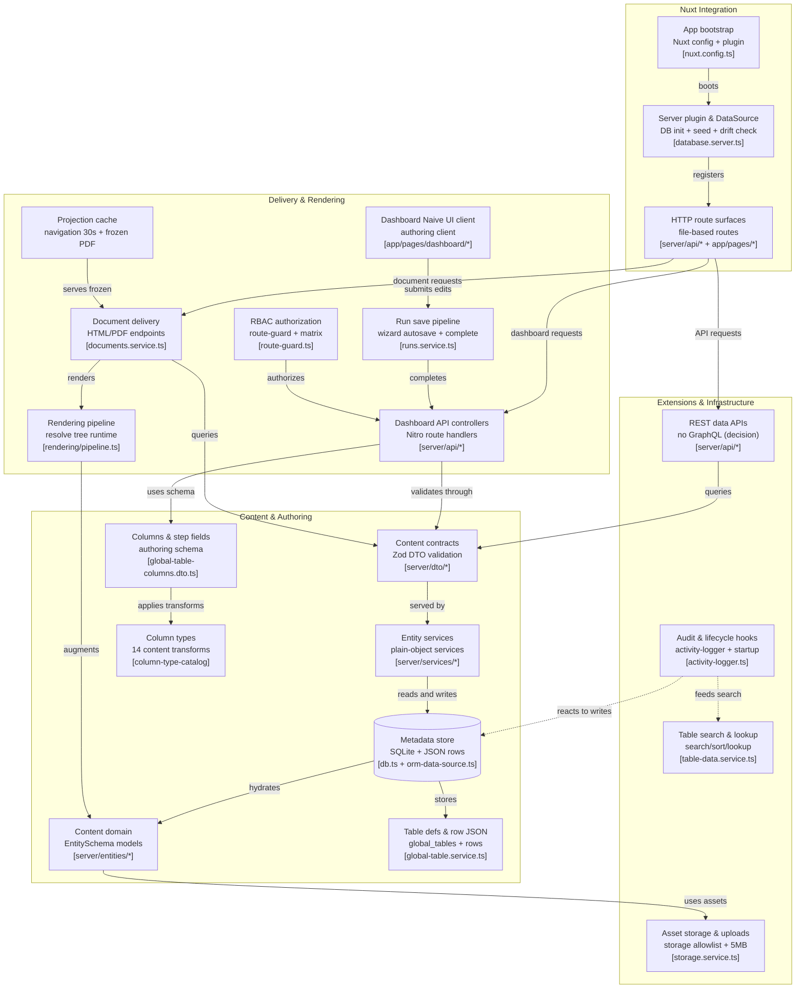

# Referensi Arsitektur — Statamic CMS → BMS

> Pemetaan arsitektur [Statamic CMS](https://github.com/statamic/cms) (Laravel flat-file CMS) ke tech stack BMS
> (Nuxt 4 + Nitro + TypeORM + SQLite + Naive UI). Statamic dipakai sebagai **referensi pola**,
> bukan sebagai dependensi — tidak ada kode Laravel di BMS.

## Diagram Adaptasi (Tech Stack BMS)

## Tabel Pemetaan (Statamic → BMS)

| Statamic (Laravel) | BMS (Nuxt 4) | Catatan adaptasi |
|---|---|---|
| `Statamic.php` package bootstrap | `nuxt.config.ts` + `server/plugins/database.server.ts` | Bootstrap Nuxt: DB init, seed, drift check, startup self-check |
| Service & route providers | Nitro plugin + `server/utils/orm-data-source.ts` | DataSource singleton 23 EntitySchema; `server/api/*` file routes ganti `web.php` |
| `Entry.php` domain model | `server/entities/*.entity.ts` (EntitySchema) | `global_tables`, `components`, `templates`, `administrations`, `documents`, … |
| `Contracts/Data` interfaces | `server/dto/*.dto.ts` (Zod, bukan interface) | Kontrak = validasi runtime; service plain-object (bukan class) |
| Stache flat-file store | SQLite + `global_table_rows` (JSON-per-row) | Stache diadaptasi jadi metadata store relasional; search/sort service-level |
| `EntryRepository` | `*-*.service.ts` (`findAll/findOne/create/update/remove`) | Pola sama: repository melayani kontrak |
| YAML/Markdown content | Definisi tabel + row JSON + template content JSON | Konten = metadata + data, bukan file |
| `Blueprint.php` | Kolom Global Table + step fields administration | Schema authoring; `STEP_FIELD_TYPES` subset kolom |
| `Bard.php` fieldtype | Katalog 14 column types ([[column-type-catalog]]) | `++` concat + computed ops menggantikan transform Bard |
| CP Inertia/Vue + `App.vue` | Dashboard Nuxt + Naive UI (`app/pages/dashboard/*`) | `SavePipeline.js` → wizard autosave + atomic complete (`runs.service.ts`) |
| `EntriesController` (CP) | Nitro handlers `server/api/*` + `requireApiAccess` | Controller = route file; otorisasi via permission-matrix |
| `Authorize.php` middleware | `requireAuth`/`requireApiAccess` (`route-guard.ts`) | Guard allow/deny hanya client-side gating |
| `FrontendController` | `documents.service.ts` (`getHtml/getPdf`) + `/api/render/preview` | Delivery = HTML tersanitasi + PDF frozen |
| Antlers `Engine.php` | `server/utils/rendering/pipeline.ts` | Resolve tree (binding/loop/condition) → HTML DOM → PDF; satu engine generik |
| Static cache manager | Cache proyeksi navigasi 30 dtk + PDF tersimpan | Tidak ada full-page static cache (decision) |
| GraphQL `Manager.php` | REST saja — **tanpa GraphQL** (decision) | Alasan: RBAC per-URL berbasis REST; GraphQL akan melemahkan enforcement |
| `AddonRepository` + events | `activity-logger` + startup checks + coverage endpoint | Ekstensi = audit trail + health; addon runtime pihak-ketiga non-goal |
| `IndexManager` search | Search/sort/lookup per-tabel + `rows/lookup` | In-memory atas JSON store (batas skala didokumentasikan) |
| Filesystem `Manager` + Glide | `storage.service.ts` (allowlist subfolder + 5 MB) | Tanpa image transform on-the-fly (decision; upload + preview saja) |

## Keputusan Adaptasi (Decision Log)

- **D-01 REST-only**: tanpa GraphQL agar enforcement RBAC method+URL tetap utuh.
- **D-02 SQLite JSON-row store** sebagai pengganti Stache: cukup untuk skala instansi kecil–menengah; FTS per-tabel adalah batas upgrade.
- **D-03 Satu rendering pipeline** (Antlers → `pipeline.ts`): tidak ada PDF per-template.
- **D-04 Tanpa Glide**: imaging = upload + preview; transformasi gambar non-goal.
- **D-05 Blueprint = kolom + step fields**: dua schema authoring berbagi enum tipe (step = subset).

## Related Concepts

- [[core-concept]] — konsep implementasi keseluruhan di atas peta ini
- [[column-type-catalog]] — katalog 14 column types (pengganti Bard)
- [[administration-runtime]] — runtime penuh + `step_field` + nested component
- [[konsep-utama]] — rantai Data → Component → Template → Administration → Document
- [[architecture-principles]] — 7 prinsip yang dipertahankan dari adaptasi ini
